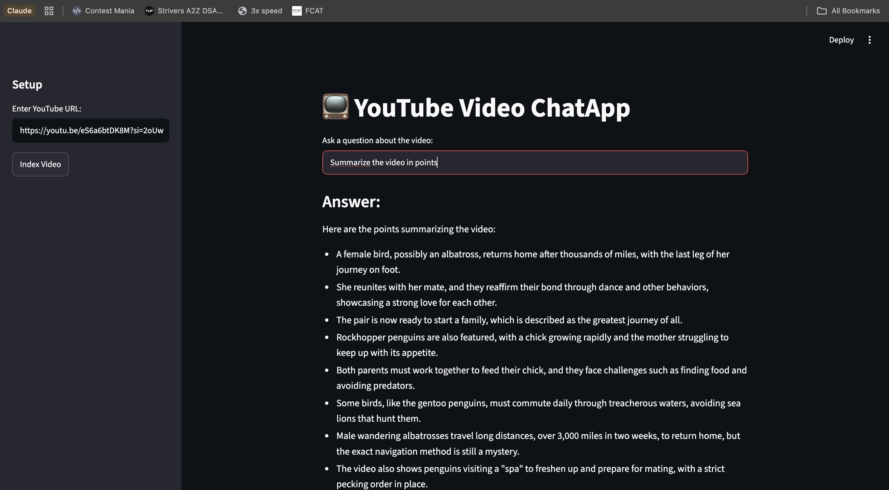

# YouTube Video Chatbot

A LangChain-based pipeline that fetches YouTube transcripts using the native Python API, chunks the text, creates FAISS embeddings locally, and queries the data.

## Features
- Direct transcript retrieval via `youtube-transcript-api` (no wrappers).
- Robust YouTube video ID parser handling standard, short, and shorts URLs.
- Local vector storage using FAISS and HuggingFace Embeddings (`all-MiniLM-L6-v2`).



## Architecture:

- **Production-Ready Modular Structure**: Separates research and frontend presentation into dedicated files (`src/app.py` for Streamlit UI and `src/chain.py` for backend execution).
- **Session State Token Optimization**: Utilizes Streamlit's `st.session_state` to cache the generated FAISS retriever object across application re-runs. This ensures the text transcription and embedding vector database are only calculated **once** per video URL, completely preventing API token wastage on subsequent user questions.
- **Parallel Execution Logic (LCEL)**: Employs true LangChain Expression Language via `RunnableParallel`, `RunnablePassthrough`, and `RunnableLambda` to fetch vector context dynamically and forward variables natively to the language model in parallel pipeline pathways.

## Installation

1. Clone the repository:
```bash
git clone <your-repo-url>
cd YouTubeChatBot
```

2. Set up your environment (link your existing `.venv` or create a new one):
```bash
source .venv/bin/activate
pip install -r requirements.txt
```

## Project Structure
- `src/app.py`: Streamlit main dashboard layout, page configurations, and state handling.
- `src/chain.py`: Isolated computational LCEL processing, vector generation, and video loading utilities.
- `main.ipynb`: Laboratory notebook for rapid testing, prototyping, and validation tracking.
- `.gitignore`: Configured to exclude local system files, local FAISS indexes, and specific key files.
